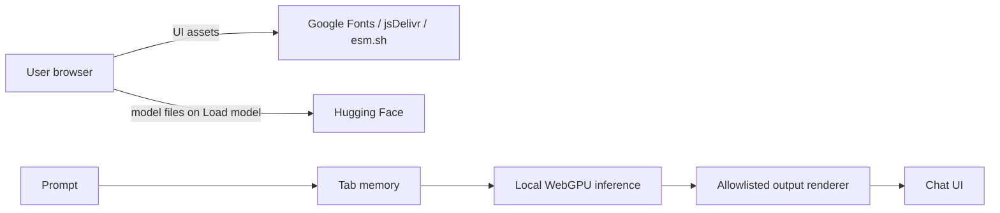

# THOXYweb Ecosystem Map

## Product vision

THOXYweb is the browser-local inference surface for ThoxKey. It provides a desktop-first chat
experience backed by Gemma 4 E2B and WebGPU without a prompt-processing backend.

## Current modules

- `index.html`: product UI, WebGPU gate, model lifecycle, chat, error states.
- `gemma-4-e2b.js`: bundled tokenizer, WebGPU runtime, weight loader, generation loop.
- `safe-markdown.js`: allowlisted rendering boundary for model output.
- `landing.js`: presentation-only WebGL scene.
- `test/smoke.mjs`: deterministic browser regression suite.

## Data flow

Prompts and responses stay inside the browser process. Application assets and model files cross
the network boundary. An air-gapped distribution is future architecture, not current evidence.

## Integration points

- ThoxKey landing/product flow
- `Thox-ai/THOXYweb-Gemma-4-E2B` model mirror (planned weights source)
- Kickstarter campaign dependency tracking

## Future architecture

Vendor and hash all browser assets, package model files for a ThoxKey-local origin, enforce a
strict CSP, and add clean-host offline and real-GPU evidence.
